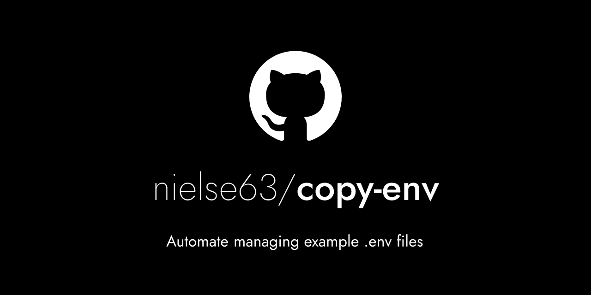

@nielse63/copy-env / [Exports](modules.md)

# copy-env

> Automate managing example .env files

<div align="center">
  <a href="https://github.com/nielse63/copy-env">
    
  </a>
</div>

Often times you'll want to be able to share and check-in your `.env` files to share with your team, or to remember wht environment variables are necessry for your project. `copy-env` automatically copies your `.env` file, removes the secret values, and saves it to an `.env.sample` file.

## Installation

Install the package globally to use the CLI:

```bash
npm i -g @nielse53/copy-env
```

Or install it in your project for scoped CLI usage, and to use the API:

```bash
npm i -D @nielse63/copy-env
```

## Usage

### CLI

Install the package and simply run `copy-env` from the command line:

```bash
$ copy-env --help
Usage: copy-env [options]

Automate managing example .env files

Options:
  --cwd <string>           Current working directory (default: ".")
  --src <string>           Source file to read from (default: ".env")
  --dest <string>          File to write to (default: ".env.sample")
  --ignore-regex <string>  Regex string of what to omit from output (default: "^#")
  --git-add                Stage the output file after update (default: false)
  -V, --version            output the version number
  -h, --help               display help for command
```

### API

See the view API usage at [`docs/modules.md`](./modules.md).

## Contributing

Contributions are what make the open source community such an amazing place to learn, inspire, and create. Any contributions you make are **greatly appreciated**.

If you have a suggestion that would make this better, please fork the repo and create a pull request. You can also simply open an issue with the tag "enhancement". Don't forget to give the project a star! Thanks again!

1. Fork the Project
2. Create your Feature Branch (`git checkout -b scratch/my-feature`)
3. Commit your Changes (`git commit -m 'added new feature'`)
4. Push to the Branch (`git push origin scratch/my-feature`)
5. Open a Pull Request

## License

Distributed under the MIT License. See [`LICENSE.txt`](./LICENSE.txt) for more information.

## Contact

Project Link: [https://github.com/nielse63/copy-env](https://github.com/nielse63/copy-env)
